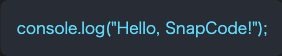
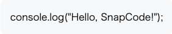

# SnapCode

SnapCode is a simple CLI tool that converts code snippets into stylish screenshots automatically.

## Features

- Input a code snippet via command line
- Generate a beautiful screenshot from the code
- Supports dark theme (default)

## Getting Started

### Build

```bash
git clone git@github.com:uruya/SnapCode.git
cd SnapCode
go build -o snapcode ./cmd/cli
```

### Usage
```bash
./snapcode -o output/light.png -theme light  'console.log("Hello, SnapCode!");'
```

## Demo

### Dark Theme (default)



### Light Theme



## HTTP API (beta)

| Method | Path      | Body Params                                   | Response          |
| ------ | --------- | --------------------------------------------- | ----------------- |
| POST   | /generate | `code` (string) – required<br>`theme` (dark\|light) – optional | `image/png` bytes |

### Quick Example

```bash
# 1) Run the server
go run ./cmd/server        # listening on localhost:8080

# 2) Request
curl -X POST http://localhost:8080/generate \
     -H "Content-Type: application/json" \
     -d '{"code":"fmt.Println(\"API Hello\")","theme":"light"}' \
     --output api_light.png